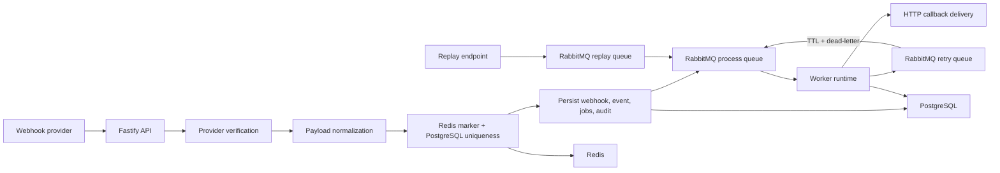

# integration-gateway

TypeScript webhook ingestion gateway for idempotent event processing, retries, replay, and delivery tracking.

`integration-gateway` is a reviewer-friendly backend project that treats webhook ingestion as a real systems problem instead of a thin HTTP controller. The repository shows provider-specific verification at the edge, canonical event normalization, durable PostgreSQL state, RabbitMQ-backed worker processing, Redis-backed control paths, and explicit replay and audit workflows.

## Quick Navigation

- [Why This Repository Matters](#why-this-repository-matters)
- [Architecture Overview](#architecture-overview)
- [Event Lifecycle and Processing Model](#event-lifecycle-and-processing-model)
- [Capability Matrix](#capability-matrix)
- [API Overview](#api-overview)
- [Local Workflow](#local-workflow)
- [Validation and Quality](#validation-and-quality)
- [Repository Structure](#repository-structure)
- [Docs Map](#docs-map)
- [Scope Boundaries](#scope-boundaries)
- [Future Improvements](#future-improvements)

## Why This Repository Matters

Most webhook samples stop at "receive JSON and write a row." This repository goes further in the places that matter for backend and integration work:

- It handles provider-specific verification and normalization before events reach the rest of the system.
- It keeps raw inbound payloads, normalized events, delivery attempts, replay requests, and audit entries as separate operational records.
- It models queue-backed worker execution, idempotency, retries, and replay as first-class lifecycle concerns rather than afterthoughts.
- It runs locally with a production-shaped stack: API and worker processes over PostgreSQL, RabbitMQ, and Redis.

## Architecture Overview

The runtime is intentionally split between synchronous ingress responsibilities and asynchronous delivery work. The API process authenticates and persists inbound webhooks, while the worker process owns delivery attempts, retry scheduling, and replay execution.

| Component      | Responsibility                                                                                                                               |
| -------------- | -------------------------------------------------------------------------------------------------------------------------------------------- |
| Fastify API    | Accept webhooks, verify provider auth, normalize payloads, write durable records, enqueue work, expose management APIs                       |
| Worker runtime | Consume process and replay queues, acquire event locks, deliver outbound callbacks, schedule retries, complete replay requests               |
| PostgreSQL     | System of record for integrations, webhook events, normalized events, processing jobs, delivery attempts, replay requests, and audit entries |
| RabbitMQ       | Durable async transport for process, retry, and replay queues                                                                                |
| Redis          | Rate limiting, idempotency markers, processing locks, and short-lived integration cache                                                      |



The implemented flow is:

1. `POST /api/v1/webhooks/:provider` receives a provider payload and preserves the raw body for verification.
2. A provider-specific verifier checks `x-acme-signature` or `x-globex-token`.
3. A provider normalizer maps the payload into a canonical internal event shape.
4. The service computes an idempotency key and attempts duplicate suppression in Redis before relying on PostgreSQL uniqueness.
5. Raw webhook data, normalized event data, initial processing-job records, and audit entries are written to PostgreSQL.
6. The API publishes a process message to RabbitMQ.
7. The worker consumes the message, locks the event in Redis, attempts outbound delivery, and records delivery outcomes.
8. Failed deliveries either schedule a delayed retry or transition the event to a terminal `failed` state.
9. Manual replay requests enqueue a replay workflow that feeds the event back into the process queue with a tracked replay request record.

## Event Lifecycle and Processing Model

The repository separates storage by lifecycle stage so operators can answer different questions without overloading a single table or API view.

| Record              | Why it exists                                                                                         | Written by                         | Where it is surfaced                                           |
| ------------------- | ----------------------------------------------------------------------------------------------------- | ---------------------------------- | -------------------------------------------------------------- |
| `webhook_events`    | Preserves raw payload, inbound headers, source IP, external event id, and idempotency key             | API ingestion path                 | `GET /events/:id`                                              |
| `normalized_events` | Canonical internal event used for queue processing and status tracking                                | API ingestion path, worker updates | `GET /events`, `GET /events/:id`, `GET /events/:id/status`     |
| `processing_jobs`   | Tracks queue scheduling and worker execution history; multiple records can exist for the same attempt | API, replay service, worker        | `GET /events/:id`, `GET /events/:id/status`                    |
| `delivery_attempts` | Records each outbound callback attempt with HTTP metadata and latency                                 | Worker                             | `GET /deliveries`, `GET /events/:id`                           |
| `replay_requests`   | Stores explicit operator-driven replay intent with actor and reason                                   | Replay endpoint and replay worker  | Persisted for lifecycle control; no standalone query route yet |
| `audit_entries`     | Append-only operational history for ingestion, queueing, retries, failures, and replay actions        | API, replay service, worker        | `GET /audit-entries`                                           |

### Idempotency Strategy

- First-pass duplicate suppression uses Redis `SET NX EX` markers keyed by the computed idempotency key.
- Durable duplicate protection uses the PostgreSQL unique constraint on `webhook_events.idempotency_key`.
- The preferred key is `provider:externalEventId`.
- If a provider payload does not carry a stable external id, the fallback key is `provider:payload:<sha256(stable-json)>`.
- If Redis is unavailable, the system falls back to PostgreSQL uniqueness rather than silently disabling duplicate protection.

### Retry and Replay Control Loops

- Process failures move the event to `retrying`, record a queued retry job, and publish a delayed message to `ig.events.retry`.
- The retry queue uses message expiration and dead-letter routing back to `ig.events.process`, which keeps the retry path inside RabbitMQ instead of depending on an external scheduler.
- Manual replay requests create a `replay_requests` row, capture `requestedBy` and `reason`, write audit history, and enqueue a replay message to `ig.events.replay`.
- Replay dispatch resets the event to `pending`, records a replay-triggered process job, and republishes work to the main process queue.

## Capability Matrix

| Area                   | Implemented behavior                                                                                                     |
| ---------------------- | ------------------------------------------------------------------------------------------------------------------------ |
| Provider auth          | `acme` uses HMAC SHA256 over the raw request body; `globex` uses a shared token header                                   |
| Webhook ingestion      | `POST /api/v1/webhooks/:provider` validates provider, payload shape, and authenticity                                    |
| Payload normalization  | Provider-specific normalizers map inbound payloads into a canonical event contract                                       |
| Idempotency            | Redis marker + PostgreSQL uniqueness with stable payload-hash fallback                                                   |
| Queue processing       | RabbitMQ process, retry, and replay queues with durable messages                                                         |
| Retries                | Worker schedules exponential backoff via queue TTL and dead-letter routing                                               |
| Replay                 | `POST /api/v1/events/:id/replay` records a replay request and republishes work                                           |
| Redis usage            | Idempotency markers, processing locks, webhook rate limits, integration cache                                            |
| PostgreSQL persistence | Integrations, raw webhooks, normalized events, processing jobs, delivery attempts, replay requests, audit entries        |
| Worker runtime         | Separate worker process consumes replay and process queues                                                               |
| Tests and CI           | Vitest unit and integration tests, ESLint, Prettier, TypeScript checks, GitHub Actions, Docker Compose config validation |

## API Overview

The README keeps the API surface high-signal. Detailed endpoint behavior, query parameters, and auth boundaries live in [docs/api-overview.md](docs/api-overview.md).

| Family              | Routes                                                                                                                                                 | Purpose                                                                         |
| ------------------- | ------------------------------------------------------------------------------------------------------------------------------------------------------ | ------------------------------------------------------------------------------- |
| Health              | `GET /api/v1/health`                                                                                                                                   | Reports dependency health for PostgreSQL, Redis, and RabbitMQ                   |
| Webhook ingress     | `POST /api/v1/webhooks/:provider`                                                                                                                      | Validates, normalizes, persists, and enqueues inbound events                    |
| Integrations        | `GET /api/v1/integrations`                                                                                                                             | Lists configured provider integrations                                          |
| Event operations    | `GET /api/v1/events`, `GET /api/v1/events/:id`, `GET /api/v1/events/:id/status`, `GET /api/v1/processing-status/:id`, `POST /api/v1/events/:id/replay` | Operational search, event detail, status polling, replay initiation             |
| Delivery history    | `GET /api/v1/deliveries`                                                                                                                               | Reviews outbound delivery attempts                                              |
| Audit trail         | `GET /api/v1/audit-entries`                                                                                                                            | Reviews recorded lifecycle actions                                              |
| Local delivery sink | `POST /api/v1/internal/delivery-sink/:provider`                                                                                                        | Non-production helper used by local seed data to validate worker delivery paths |

Management routes require `x-internal-api-key`. Webhook ingress and health remain public. The internal delivery sink is disabled when `NODE_ENV=production`.

## Local Workflow

The default path is Docker-first. Compose boots PostgreSQL, Redis, RabbitMQ, a migration-and-seed job, the API, the worker, and an Nginx proxy.

### Quick Start

```bash
docker compose up --build -d
docker compose logs -f migrator api worker
curl -s http://localhost:3000/api/v1/health | jq
docker compose down
```

### Service Endpoints

| Service       | Address                  |
| ------------- | ------------------------ |
| API           | `http://localhost:3000`  |
| Nginx proxy   | `http://localhost:8082`  |
| PostgreSQL    | `localhost:5434`         |
| Redis         | `localhost:6381`         |
| RabbitMQ AMQP | `localhost:5672`         |
| RabbitMQ UI   | `http://localhost:15672` |

### Non-Docker Workflow

Use this only if PostgreSQL, Redis, and RabbitMQ are already running outside Compose.

```bash
cp .env.example .env
npm install
npm run db:migrate
npm run db:seed
npm run dev
npm run worker:dev
```

The seed script creates `acme` and `globex` integrations and points their callback URLs at the internal delivery sink so the full ingest-to-worker loop can be exercised locally.

## Validation and Quality

| Command                             | Purpose                                            |
| ----------------------------------- | -------------------------------------------------- |
| `npm run lint`                      | ESLint over the codebase                           |
| `npm run format`                    | Prettier check                                     |
| `npm run typecheck`                 | TypeScript compile-time validation                 |
| `npm test`                          | Vitest unit and integration coverage               |
| `npm run build`                     | Compile API and worker output into `dist/`         |
| `npm run verify`                    | Run lint, format, typecheck, and tests as one gate |
| `docker compose config > /dev/null` | Validate Compose configuration                     |

## Repository Structure

```text
.
|- src/
|  |- api/               # Fastify app, routes, auth, response contracts
|  |- application/       # Ingestion, replay, query, and processing services
|  |- domain/            # Shared types and error contracts
|  |- infrastructure/    # PostgreSQL, RabbitMQ, Redis, HTTP, config, container wiring
|  `- worker/            # Queue consumers for replay and processing
|- docs/                 # Architecture, domain, API, security, and workflow notes
|- tests/                # Unit and integration coverage
|- docker/               # Container and Nginx definitions
`- .github/workflows/    # CI pipeline
```

## Docs Map

| Document                                               | Focus                                                            |
| ------------------------------------------------------ | ---------------------------------------------------------------- |
| [docs/architecture.md](docs/architecture.md)           | System boundaries, queue topology, runtime responsibilities      |
| [docs/domain-model.md](docs/domain-model.md)           | Persistence model, lifecycle records, status semantics           |
| [docs/api-overview.md](docs/api-overview.md)           | Route families, auth boundaries, request and response contracts  |
| [docs/webhook-flow.md](docs/webhook-flow.md)           | Ingest-to-worker lifecycle, idempotency, retries, replay         |
| [docs/security.md](docs/security.md)                   | Verification, management auth, rate limiting, integrity controls |
| [docs/local-development.md](docs/local-development.md) | Docker workflow, service endpoints, local validation commands    |
| [docs/deployment-notes.md](docs/deployment-notes.md)   | Runtime split, release ordering, operational deployment notes    |
| [docs/roadmap.md](docs/roadmap.md)                     | Grounded next steps and explicit non-implemented areas           |

## Scope Boundaries

This repository is intentionally sharp in scope. It demonstrates integration and backend reliability patterns without pretending to ship a full platform.

| Current boundary                           | Why it is bounded this way                                                                                            |
| ------------------------------------------ | --------------------------------------------------------------------------------------------------------------------- |
| Two example providers: `acme` and `globex` | Enough to show the adapter and verification model without inflating the integration catalog                           |
| Internal API key for management routes     | Suitable for private operational endpoints in this repository; not presented as end-user auth                         |
| Local internal delivery sink               | Keeps end-to-end delivery validation self-contained for local and test flows                                          |
| RabbitMQ TTL and dead-letter retries       | Demonstrates queue-native retry control without adding an external scheduler                                          |
| No cloud-specific deployment manifests     | Keeps the project centered on backend behavior rather than vendor packaging                                           |
| No standalone replay-request query API     | Replay state is persisted and auditable, but the repository does not yet expose a dedicated replay-management surface |

## Future Improvements

- Add dead-letter inspection and operator recovery tooling around failed queue messages.
- Add metrics and tracing for queue lag, delivery latency, and retry volume.
- Add per-integration delivery policy overrides for timeout and retry behavior.
- Replace the shared management key with stronger service-to-service authentication for the management plane.
