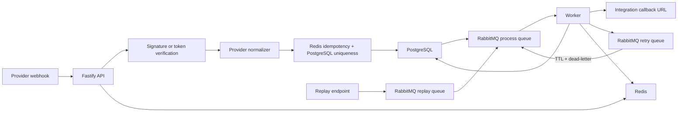

# Architecture

Related: [README](../README.md) | [Domain Model](domain-model.md) | [Webhook Flow](webhook-flow.md) | [Deployment Notes](deployment-notes.md)

`integration-gateway` is organized as a split-process backend: the API owns ingress and query responsibilities, while the worker owns queue consumption, delivery attempts, retries, and replay execution.

## Runtime Overview

| Runtime element | Responsibility                                                                                                                                                |
| --------------- | ------------------------------------------------------------------------------------------------------------------------------------------------------------- |
| API service     | Accepts webhooks, preserves raw bodies, verifies provider auth, normalizes payloads, writes durable records, publishes queue messages, serves management APIs |
| Worker service  | Consumes replay and process queues, acquires event locks, performs HTTP delivery, records attempt history, schedules retries, closes replay requests          |
| PostgreSQL      | Durable system of record for integrations, webhooks, normalized events, processing jobs, delivery attempts, replay requests, and audit entries                |
| RabbitMQ        | Carries durable async commands for process, retry, and replay workflows                                                                                       |
| Redis           | Handles webhook rate limiting, idempotency markers, event locks, and short-lived integration cache                                                            |
| Nginx           | Optional local reverse proxy in Docker Compose                                                                                                                |

## Topology

## Boundary Definition

### Public API surface

- `GET /api/v1/health`
- `POST /api/v1/webhooks/:provider`

### Protected management surface

- `GET /api/v1/integrations`
- `GET /api/v1/events`
- `GET /api/v1/events/:id`
- `GET /api/v1/events/:id/status`
- `GET /api/v1/processing-status/:id`
- `POST /api/v1/events/:id/replay`
- `GET /api/v1/deliveries`
- `GET /api/v1/audit-entries`

Management routes require `x-internal-api-key` and are intentionally framed as private operational APIs rather than a public control plane.

## Queue Topology

| Queue               | Produced by                           | Consumed by                                        | Purpose                                                                     |
| ------------------- | ------------------------------------- | -------------------------------------------------- | --------------------------------------------------------------------------- |
| `ig.events.process` | API ingestion path, replay dispatcher | Worker                                             | Primary event processing and outbound delivery                              |
| `ig.events.retry`   | Worker                                | RabbitMQ dead-letter routing back to process queue | Delayed retry scheduling using message expiration                           |
| `ig.events.replay`  | Replay endpoint                       | Worker                                             | Replay dispatch workflow before the event returns to the main process queue |

The retry queue is configured with a dead-letter target of `ig.events.process`, which keeps retry scheduling self-contained inside RabbitMQ.

## Processing Responsibilities

### API path

1. Rate-limit inbound traffic by provider and source IP.
2. Load the active integration configuration.
3. Verify provider-specific webhook credentials.
4. Normalize the payload into the internal event model.
5. Compute the idempotency key.
6. Persist webhook, event, job, and audit records in PostgreSQL.
7. Publish a process message to RabbitMQ.

### Worker path

1. Acquire a Redis lock for the event id.
2. Create and update processing-job records for the current execution.
3. Deliver the normalized payload to the integration callback URL.
4. Persist delivery-attempt history and update event state.
5. Schedule a retry or mark the event failed when delivery does not succeed.
6. Mark replay requests completed or failed when the message originated from a replay workflow.

## Reliability Model

| Concern                      | Implemented mechanism                                                          |
| ---------------------------- | ------------------------------------------------------------------------------ |
| Duplicate webhook bursts     | Redis `SET NX EX` idempotency marker                                           |
| Durable duplicate protection | PostgreSQL unique constraint on `webhook_events.idempotency_key`               |
| Concurrent worker handling   | Redis lock keyed by normalized event id                                        |
| Retry scheduling             | RabbitMQ retry queue with message expiration and dead-letter routing           |
| Auditability                 | `audit_entries`, `processing_jobs`, `delivery_attempts`, and `replay_requests` |
| Dependency visibility        | Health endpoint checks PostgreSQL, Redis, and RabbitMQ                         |

## Design Notes and Trade-offs

- Queue publication is explicit application logic rather than hidden behind a framework abstraction.
- The repository uses direct SQL repositories to keep persistence rules visible during review.
- Replay is modeled as a queue-backed control loop, not a direct synchronous re-run.
- Management authentication is intentionally lightweight. It is appropriate for a private operational surface, not a user-facing auth story.

For status and persistence details, continue with [domain-model.md](domain-model.md) and [webhook-flow.md](webhook-flow.md).
