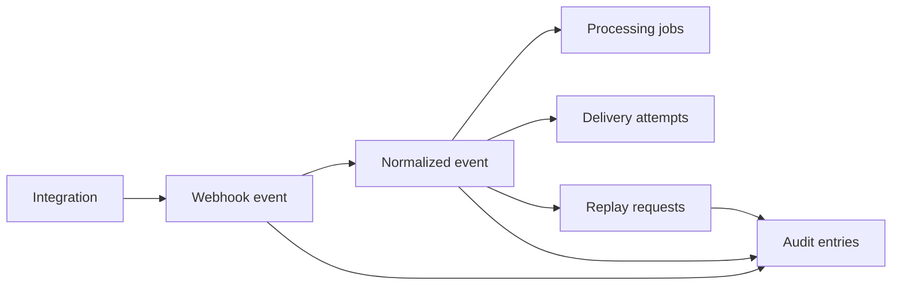

# Domain Model

Related: [README](../README.md) | [Architecture](architecture.md) | [Webhook Flow](webhook-flow.md) | [API Overview](api-overview.md)

The data model separates ingress, canonicalization, worker execution, and audit concerns into distinct records. That separation is what makes replay, retries, and operator-facing queries understandable.

## Logical Record Map

The diagram shows logical lineage, not strict foreign-key coverage for every record. In particular, `audit_entries` is a generic append-only log keyed by `entity_type` and `entity_id`.

## Core Records

| Record              | Purpose                                                            | Key fields                                                                                                                       |
| ------------------- | ------------------------------------------------------------------ | -------------------------------------------------------------------------------------------------------------------------------- |
| `integrations`      | Provider configuration used for verification and outbound delivery | `provider`, `webhook_secret`, `callback_url`, `is_active`                                                                        |
| `webhook_events`    | Raw inbound request record captured before async processing        | `provider`, `external_event_id`, `idempotency_key`, `request_headers`, `raw_payload`, `source_ip`, `received_at`                 |
| `normalized_events` | Canonical internal event used by workers and management APIs       | `event_type`, `subject`, `occurred_at`, `normalized_payload`, `status`, `processing_attempts`, `last_error`, `last_processed_at` |
| `processing_jobs`   | Queue scheduling and execution trace for each processing step      | `queue_name`, `triggered_by`, `status`, `attempt_no`, `scheduled_at`, `started_at`, `completed_at`, `error_message`              |
| `delivery_attempts` | One outbound HTTP delivery attempt                                 | `attempt_no`, `status`, `http_status`, `response_body`, `error_message`, `duration_ms`                                           |
| `replay_requests`   | Operator-requested reprocessing request                            | `requested_by`, `reason`, `status`, `created_at`, `processed_at`                                                                 |
| `audit_entries`     | Append-only lifecycle ledger for important actions                 | `entity_type`, `entity_id`, `action`, `actor`, `details`, `created_at`                                                           |

## State Semantics

### Event states

| State        | Meaning                                                           |
| ------------ | ----------------------------------------------------------------- |
| `pending`    | Accepted and persisted but not currently executing                |
| `processing` | Worker is handling the event now                                  |
| `processed`  | Delivery succeeded                                                |
| `retrying`   | A failed attempt scheduled another queue-driven retry             |
| `failed`     | Delivery exhausted retries or hit a terminal processing condition |

### Processing-job states

| State       | Meaning                                  |
| ----------- | ---------------------------------------- |
| `queued`    | Work was scheduled onto a queue          |
| `running`   | Worker started processing                |
| `succeeded` | Worker completed the step successfully   |
| `failed`    | Worker completed the step unsuccessfully |

### Replay-request states

| State        | Meaning                                                      |
| ------------ | ------------------------------------------------------------ |
| `queued`     | Replay request was accepted and persisted                    |
| `dispatched` | Replay worker moved the event back to the main process queue |
| `completed`  | Replay-triggered processing eventually succeeded             |
| `failed`     | Replay dispatch or replay-triggered processing failed        |

## Lifecycle Relationships

| Relationship                          | Implemented rule                                                                      |
| ------------------------------------- | ------------------------------------------------------------------------------------- |
| Integration to webhook events         | `webhook_events.integration_id` references `integrations.id`                          |
| Webhook event to normalized event     | One-to-one via unique `normalized_events.webhook_event_id`                            |
| Normalized event to delivery attempts | One-to-many, unique on `(normalized_event_id, attempt_no)`                            |
| Normalized event to processing jobs   | One-to-many queue and execution history                                               |
| Normalized event to replay requests   | One-to-many replay control history                                                    |
| Audit entry references                | Generic by `entity_type` and `entity_id`, intentionally not hard-wired by foreign key |

## Constraints That Matter Operationally

| Constraint                                                        | Why it matters                                                           |
| ----------------------------------------------------------------- | ------------------------------------------------------------------------ |
| `webhook_events.idempotency_key` unique                           | Durable duplicate protection under race conditions                       |
| `normalized_events.webhook_event_id` unique                       | Keeps canonical event storage one-to-one with the inbound webhook record |
| `delivery_attempts(normalized_event_id, attempt_no)` unique       | Prevents duplicate attempt numbers for the same event                    |
| Foreign keys from event artifacts back to integrations and events | Keeps worker and query history attached to a valid source record         |

## Query Model

The management APIs are shaped around operator workflows rather than generic CRUD:

- Event list queries filter by provider, status, event type, subject, and time range.
- Event detail returns both the normalized event and the raw webhook snapshot.
- Delivery history is queryable independently from event detail for operational review.
- Audit history is queryable by entity type, entity id, and action.
- Replay requests are persisted, but there is no standalone replay-request list endpoint yet.

For runtime flow details, continue with [webhook-flow.md](webhook-flow.md).
