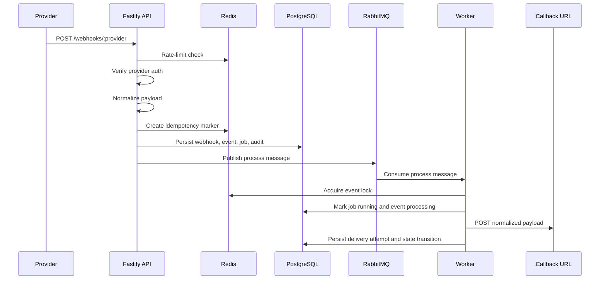
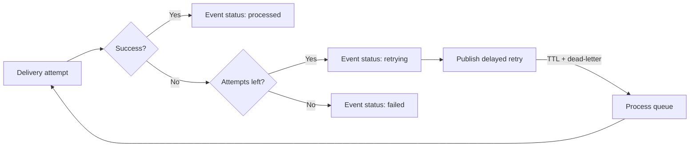

# Webhook Flow

Related: [README](../README.md) | [Architecture](architecture.md) | [Domain Model](domain-model.md) | [API Overview](api-overview.md)

This document follows an event from the first inbound request through normalization, persistence, queueing, worker delivery, retry scheduling, and replay.

## Request-to-Worker Lifecycle

## 1. Ingress and Verification

The webhook path starts at `POST /api/v1/webhooks/:provider`.

- `fastify-raw-body` preserves the request body for signature validation.
- The ingestion service rate-limits by provider and source IP before deeper work starts.
- `acme` verification checks an HMAC SHA256 signature in `x-acme-signature`.
- `globex` verification checks a shared token in `x-globex-token`.
- The integration must exist and be active before ingestion continues.

Requests that fail verification or validation are rejected before durable persistence.

## 2. Normalization and Idempotency

Each provider payload is mapped into the same internal shape:

- `externalEventId`
- `eventType`
- `occurredAt`
- `subject`
- `normalizedPayload`

The idempotency strategy is layered:

| Layer                        | Mechanism                                                              | Purpose                                                                    |
| ---------------------------- | ---------------------------------------------------------------------- | -------------------------------------------------------------------------- |
| Fast duplicate suppression   | Redis `SET NX EX` marker                                               | Reject repeated bursts quickly without hitting PostgreSQL first            |
| Durable duplicate protection | Unique `webhook_events.idempotency_key`                                | Protect against races and Redis failure paths                              |
| Key generation               | `provider:externalEventId` or `provider:payload:<sha256(stable-json)>` | Keep duplicate detection deterministic even when providers omit stable ids |

When Redis declines a new marker, the service looks up the existing event and returns a duplicate response instead of enqueueing work twice.

## 3. Durable Persistence

The ingestion transaction writes more than a single event row:

1. `webhook_events` captures the raw inbound request.
2. `normalized_events` stores the canonical event shape with status `pending`.
3. `processing_jobs` gets an initial `queued` entry for the process queue.
4. `audit_entries` records webhook receipt and normalization.

If PostgreSQL rejects the insert because of the idempotency constraint, the service resolves the duplicate event id and returns it.

If queue publication fails after the transaction commits, the event is marked `failed`, a failed processing job is recorded, and an audit entry captures the queue-publication error.

## 4. Async Processing

The API publishes a message to `ig.events.process` with:

- `normalizedEventId`
- `attemptNo`
- `triggeredBy`
- `correlationId`
- `replayRequestId` when the message came from a replay workflow

The worker consumes that message and:

1. Acquires a Redis lock for the event id.
2. Creates a running processing-job record.
3. Marks the normalized event as `processing`.
4. Sends the normalized payload to the integration callback URL.
5. Persists a `delivery_attempts` row with HTTP status, response body, error message, and latency.

## 5. Retry Behavior

Retry rules are worker-driven:

- Each failed attempt records a failed delivery attempt and a failed processing job.
- If retries remain, the worker increments the attempt number, creates a queued retry job, and publishes to `ig.events.retry`.
- Retry delay is exponential: `RETRY_BASE_DELAY_MS * 2^(attemptNo - 1)`.
- Once the maximum attempt count is reached, the event becomes `failed`.

## 6. Replay Behavior

Replay is an explicit operator action, not an automatic branch of the retry path.

1. `POST /api/v1/events/:id/replay` validates `requestedBy` and `reason`.
2. The replay service persists a `replay_requests` row with status `queued`.
3. A replay processing job and audit entry are written.
4. A message is published to `ig.events.replay`.
5. The worker consumes the replay message, marks the replay request `dispatched`, resets the event to `pending`, records a replay-triggered process job, and republishes to `ig.events.process`.
6. When replay-triggered processing eventually succeeds or fails, the replay request is updated to `completed` or `failed`.

## 7. Audit and Query Surfaces

The repository keeps multiple query paths for operators:

| Need                                                   | Route                                                                  |
| ------------------------------------------------------ | ---------------------------------------------------------------------- |
| Search events by provider, type, status, or time range | `GET /api/v1/events`                                                   |
| Inspect raw webhook plus event detail                  | `GET /api/v1/events/:id`                                               |
| Poll current status and recent jobs                    | `GET /api/v1/events/:id/status` or `GET /api/v1/processing-status/:id` |
| Review outbound delivery history                       | `GET /api/v1/deliveries`                                               |
| Review lifecycle actions                               | `GET /api/v1/audit-entries`                                            |

That separation is what makes replay, retries, and duplicate handling inspectable after the fact.
